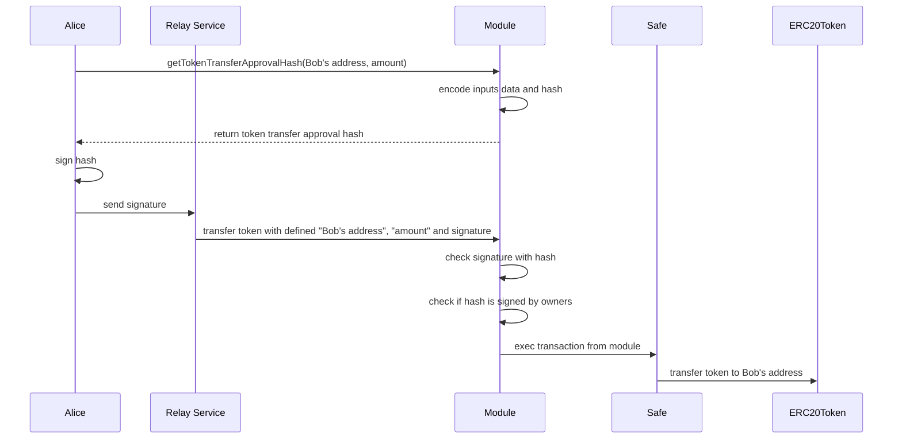

# module-test
home task for a module development of safe contract

# Setup an test
Setup environment:
```
$ yarn install && yarn run compile
```
Check test coverage for contracts:
```
$ yarn run coverage
```

# Developed modules
## Use case (from the PDF)
Alice has set up a Safe which they use to hold all of their Unicorn tokens. They want to hand out unicorn tokens easily without having to trigger a transaction each time. Therefore they enable the module written in this challenge. Now they can generate a signature which allows anyone to withdraw Unicorn tokens from their Safe.
With this, Alice generates a signature for a withdrawal of 10 Unicorn tokens and shares it with Bob. Now Bob can use this signature and interact with the module which will then send 10 Unicorn tokens from Alice’s Safe to Bob's address.

### TokenTransferModule
This module has the features below:
- Gnosis Safe's owner can pre-approve token transfer
- Anyone who has the signature can send the pre-approved token transfer

#### Overview

#### Flow of token transfer using TokenTransferModule
Alice wants to send tokens to Bob from her wallet. She pre-approve by signing the transfer transaction, and send the signature with Bob's address and amount to Bob. Bob then interact TokenTransferModule to send transaction with given signature on behalf of Alice. Bob will pay for the transaction fee.



#### Issues of TokenTransferModule

- EIP-1271 signature is not supported
