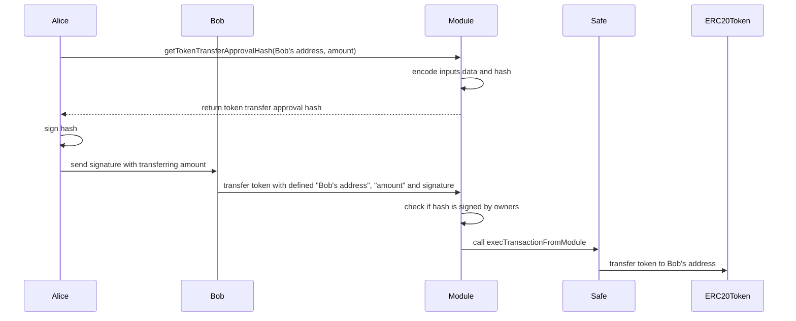

# module-test
home task for a module development of safe contract

# Setup an test
Setup environment:
```
$ yarn install && yarn run compile
```
Check test coverage for contracts:
```
$ yarn run coverage
```

# TokenTransferModule
This module has the features below:
- Gnosis Safe's owner can pre-approve token transfer
- Anyone who has the signature can send the pre-approved token transfer
- Deployable through SafeProxyFactory
- Supports all signature types GnosisSafe accepts
- Supports multiple signatures (optional feature implementation)
(The optional feature that invalidate signature after set period is not implemented in this version)

#### Flow of token transfer using TokenTransferModule
Alice wants to send tokens to Bob from her wallet. She pre-approves the token transfer by signing, and send the signature with amount to Bob. Bob then interacts TokenTransferModule contract to send transaction with given signature on behalf of Alice. Bob will pay for the transaction fee.


