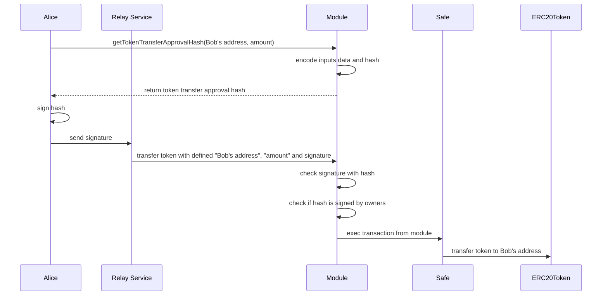

# module-test
home task for a module development of safe contract

# module
## use case

### TokenTransferModule
#### Overview

#### Example flow of token transfer using TokenTransferModule
Alice wants to send tokens to Bob from her wallet. She pre-approve by signing the transfer transaction, and send the signature with Bob's address and amount to Relay Service. Relay Service then interact TokenTransferModule to send transaction with given signature on behalf of Alice. Relay Service will pay for the transaction fee.

#### Issues

- Token
